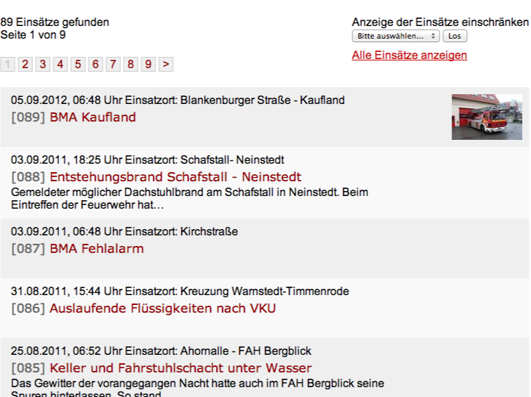
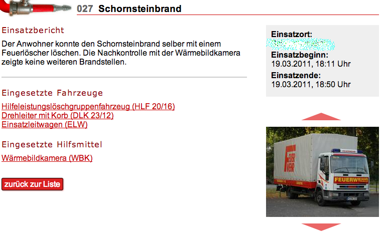
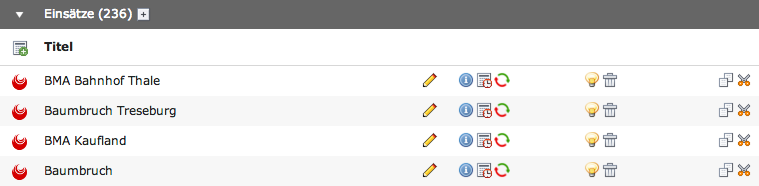
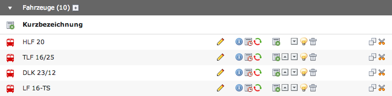
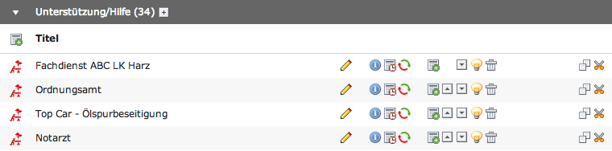
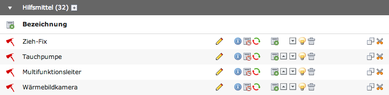
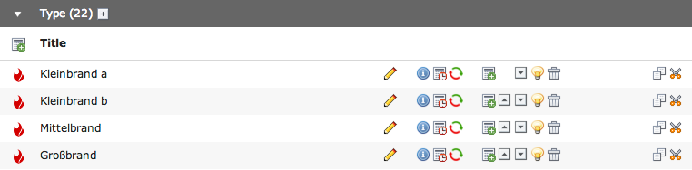

.. ==================================================
.. FOR YOUR INFORMATION
.. --------------------------------------------------
.. -*- coding: utf-8 -*- with BOM.

.. include:: ../Includes.txt

.. _users-manual:

Screenshots
===========

Here are screenshots in frontend.
--------------------------------

	Frontend - List view of oprations with thumbnails
	
	

	Frontend - Single view of oprations with report, used vehicle and resources

Here are screenshots in backend
-------------------------------

.. figure:: ../Images/edit.png
	:width: 500px
	:alt: Backend - Edit operation data
	:align: left

	Backend - Edit operation data

	Backend - List with operations
	
	

	Backend - List with vehicles
	
	

	Backend - List with assistance
	

	Backend - List with resources
	
	

	Backend - List with type of operation