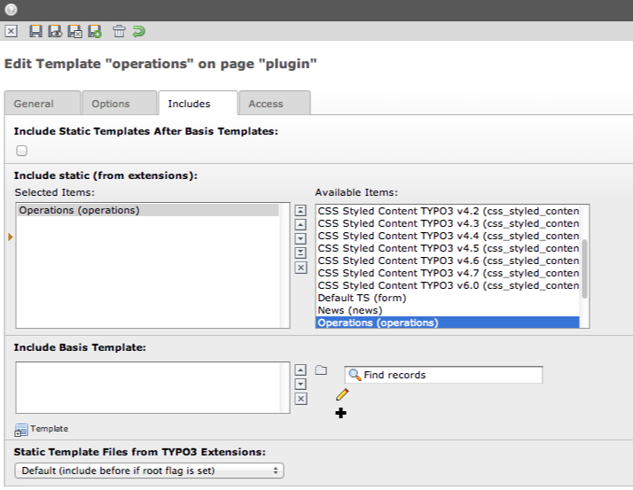
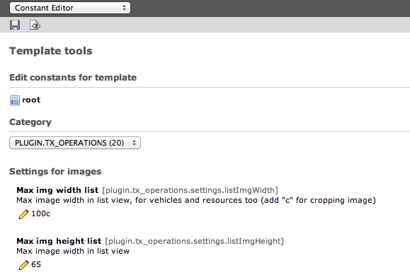

.. ==================================================
.. FOR YOUR INFORMATION
.. --------------------------------------------------
.. -*- coding: utf-8 -*- with BOM.

.. include:: ../../Includes.txt

.. _install:

Installation
------------

Go to extension manager download and install the extension in backend. After this you can make a sysfolder in your page tree to put data of operations here.
For plugin views in frontend create a typoscript template for include static template of the extension. Here you can change the setup or constants in typoscript and change the default setup. Don't forget to specify pid for persistance storage.

	Include static typoscript template

Use typoscript constants or setup to adapt settings to your individually conditions. Most important settings find you in constant editor. Also you can use constant editor to show default values for image settings in list or single view.

	Settings in constant editor
	
	
	Typoscript
	
