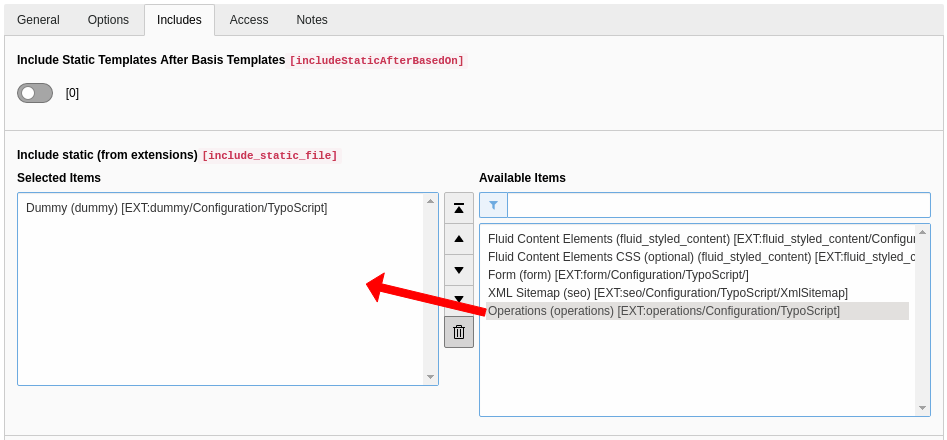

.. include:: ../Includes.txt

.. _configuration:

=============
Configuration
=============

Include static TypoScript
=========================

The extension come with some TypoScript which needs to be included.

#. Select the root page of your site.

#. Switch to the **Template module** and select *Info/Modify*.

#. Press the link **Edit the whole template record** and switch to the tab *Includes*.

#. Select **Operations (operations)** at the field *Include static (from extensions):*

   Include static TypoScript

TypoScript Example
==================

Minimal example of TypoScript to overwrite a setting in operations:

.. code-block:: typoscript

    plugin.tx_operations.settings {
        # set length of cropped teaser
        cropTeaser = 200
        single {
            showNoReport = 1
        }
    }

.. _configuration-plugin:

Plugin
======

The most important configuration settings can be done in the content element plugin.

Because of using Extbase every setting can also be done by using typoscript but remember that the settings of the plugin always override the settings from typoscript.

Tab "Options"
"""""""""""""

.. t3-field-list-table::
 :header-rows: 1

 - :Property:
		Property:
   :View:
		View:
   :Description:
		Description:
   :Key:
		Key:

 - :Property:
		What to display
   :View:
		All
   :Description:
        `Selection of view:`
    - Operations: List and single view of operations
    - Vehciles: List and single view of vehicles
    - Resources: List and single view of resources
   :Key:

 - :Property:
		Record Storage Page
   :View:
		All
   :Description:
		Sysfolder where are the data sets in
   :Key:
		persistence.storagePid
 - :Property:
		Items per page
   :View:
		Operations
   :Description:
		How many items will showing in list view. When pagination is hide is this the limit for the complete result.
   :Key:
		settings.itemsPerPage
 - :Property:
		Max chars of teaser text in list view
   :View:
		Operations
   :Description:
		Maximum length of teaser Text in list view.
   :Key:
		settings.cropTeaser
 - :Property:
		Hide pagination
   :View:
		Operations
   :Description:
		Hide the pagination and show the whole in one list. Default Limit for whole list is 200.
   :Key:
		settings.hidePagination
 - :Property:
		Hide filter for result
   :View:
		Operations
   :Description:
		Hide the form to filter the list by years (more selection can be added in future)
   :Key:
		settings.hideFilter
 - :Property:
		Show list of operations on a map
   :View:
		Operations
   :Description:
		Show the listed result in frontend on a google map.
   :Key:
		settings.showMap

Tab "Image options"
"""""""""""""""""""

.. t3-field-list-table::
 :header-rows: 1

 - :Property:
        Property:
   :View:
        View:
   :Description:
        Description:
   :Key:
        Key:

 - :Property:
        Thumbnail in list view
   :View:
        Operations
   :Description:
        Show the first media of item as thumbnail in list
   :Key:
        settings.showMediaInList

 - :Property:
        Media dimension in list/single view
   :View:
        All
   :Description:
        Set media dimensions for list and single view if you like.
   :Key:
        settings.listMediaWidth
        settings.listMediaHeight
        settings.singleMediaWidth
        settings.singleMediaHeight

Tab "Template Options"
""""""""""""""""""""""

.. t3-field-list-table::
 :header-rows: 1

 - :Property:
        Property:
   :View:
        View:
   :Description:
        Description:
   :Key:
        Key:

 - :Property:
        Template layout selector
   :View:
        All
   :Description:
        Set items in Page TS-Config before using
        ::
            tx_operations.templateLayouts {
                key = value
            }
   :Key:
        settings.templateLayout
