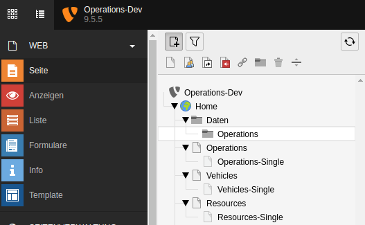

.. include:: ../Includes.txt

.. _for-editors:

===========
For Editors
===========

Create a sysfolder in page tree to organize the data. If you want, you can use separate sysfolders for related data like type, vehicles, resources. There is a setting to get data recursive from storage sysfolder.

It's recommend to create data in this order:

- operation types
- vehicles (if needed)
- used resources (if needed)
- assistance on operations (if needed)
- now create operation data

Second step is creating pages for list and single views in frontend.

.. tip::

   Thinking about speaking urls paths is a good thing to find a good structure for your pages. My favorite are the single views below list views.

   Page tree with pages for frontend views

.. _editor-faq:

FAQ
===

Possible subsection: FAQ
